# Architecture map and critical sequences

This document is the stable, high-level repository map for humans and coding
agents. It explains ownership and runtime flow; it is not a generated symbol
index. Executable configuration and source code remain authoritative:

- `template-kit/repository-facts.json` owns machine-readable repository facts
  and enforced import boundaries.
- `packages/app-config` owns source-controlled product composition.
- `apps/server/src/db` owns business schema and migration history.
- `apps/server/src/index.ts` and `apps/server/src/app/create-app.ts` own the
  Server Worker entry points.

Update these diagrams only when a boundary or lifecycle changes. File moves
inside an unchanged module do not require diagram churn.

## System topology

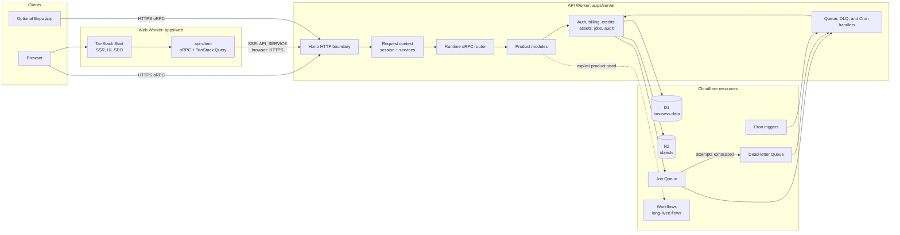

The Server Worker is the sole owner of business D1. The Web Worker has an
`API_SERVICE` binding but no business D1 binding. Optional mobile is a separate
workspace and uses the same public API contract.

## Source ownership and dependency direction

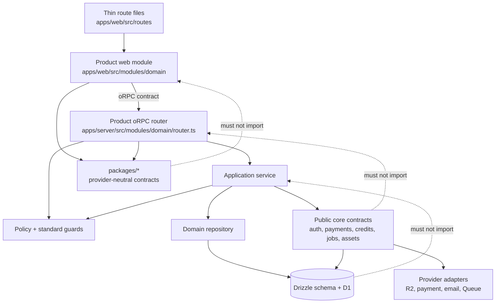

The dashed arrows are forbidden reverse dependencies. Not every small module
needs every layer; create only the files used by that domain.

## Product configuration to runtime surface

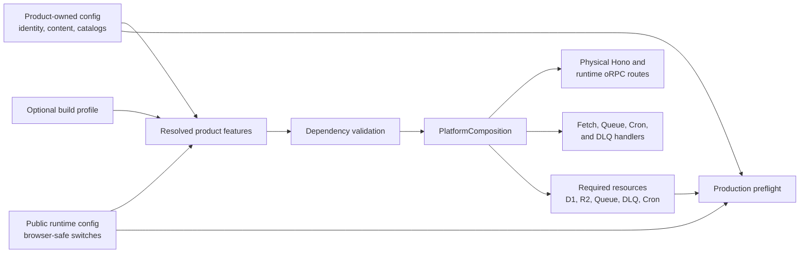

Profiles and feature contracts describe the runtime; they do not mutate files
or create Cloudflare resources. Disabled modules are physically omitted where
the runtime supports omission, while ordered migration history remains intact.

## Account creation, verification, and session lifecycle

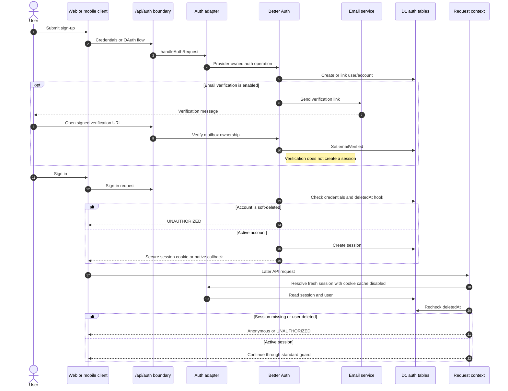

Account deletion first rejects an active subscription, then soft-deletes and
anonymizes the user and removes their sessions. Email verification alone never
grants an authenticated session.

## Authenticated product request

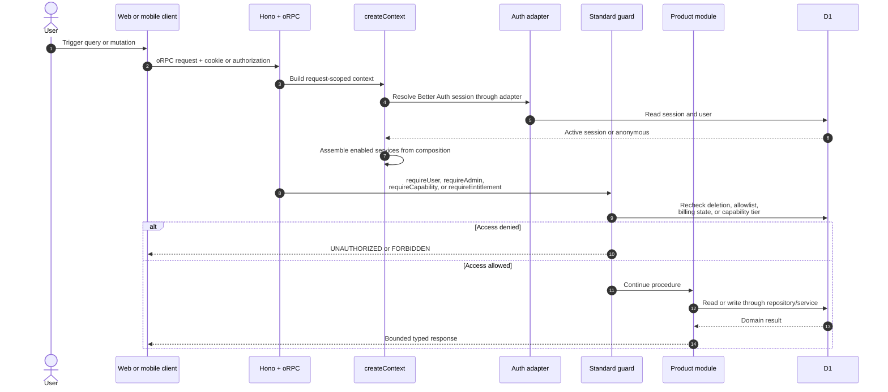

Administrator access and paid entitlement are independent. UI visibility is
presentation only; the Server guard makes the authorization decision on every
protected procedure.

## Checkout to verified entitlement or credits

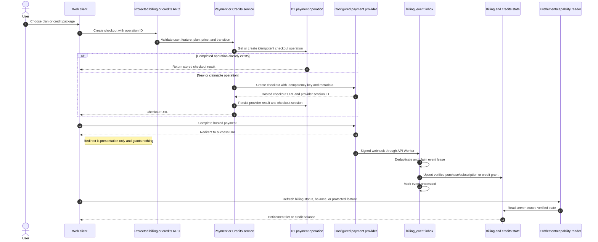

The checkout operation prevents duplicate provider sessions; the webhook event
prevents duplicate financial effects. Only verified server state affects
entitlements and balances.

## Verified payment webhook and entitlement update

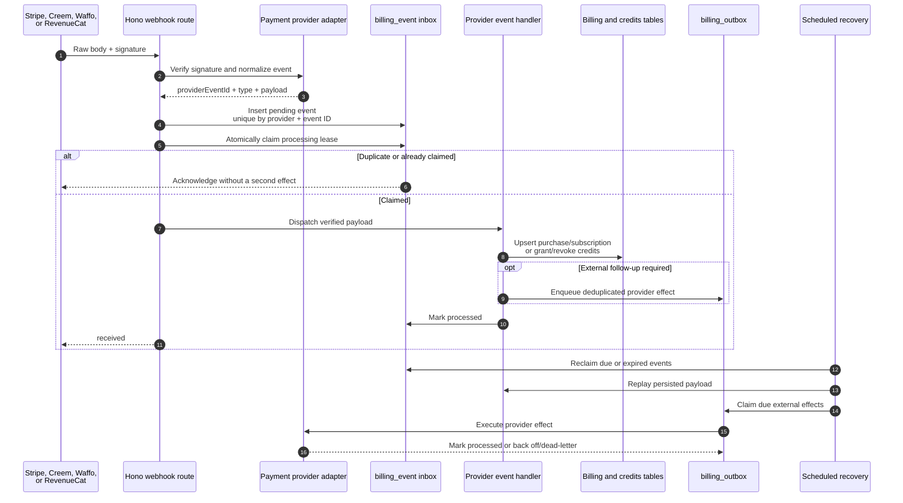

Future capability checks read the webhook-backed billing state. A redirect or
client-side success screen never grants entitlement.

## Billable operation settlement

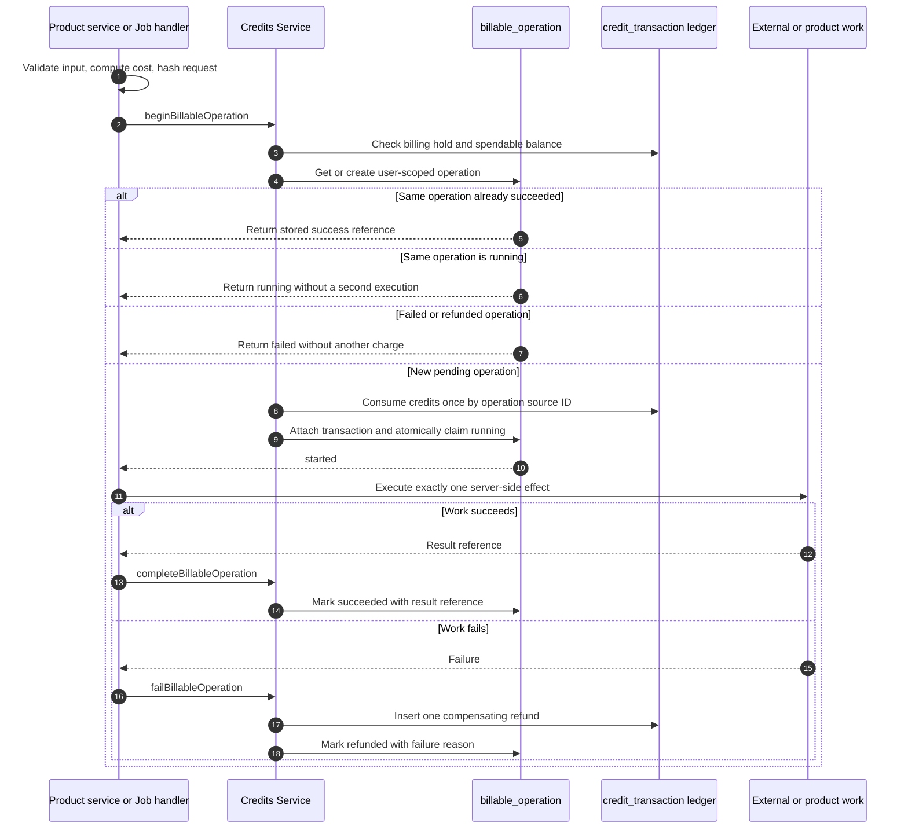

The operation ID and request hash bind one validated request to one charge and
one execution. Failure compensation is ledger-based and idempotent; callers do
not edit balances directly.

## Durable Job lifecycle

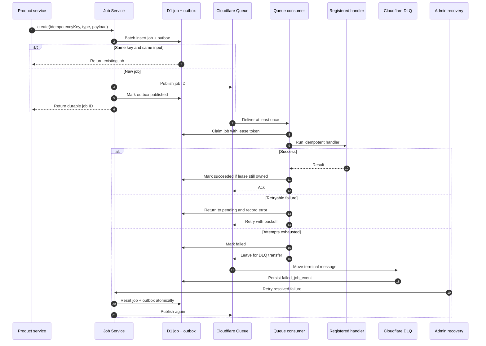

Creating the D1 job and its outbox is the durability boundary. Queue delivery
is at least once, so handler external effects must also use the job's
idempotency contract.

## Product asset lifecycle

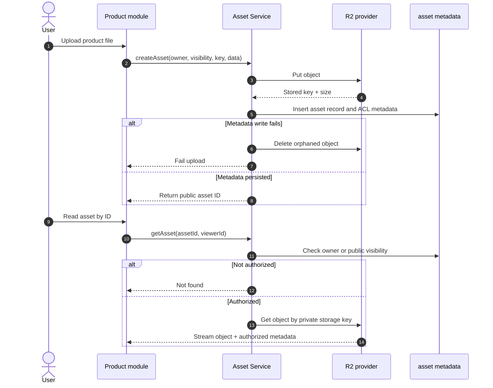

The existing avatar storage route is a constrained legacy raw-key path. New
product files use asset IDs and the Asset Service; a raw storage key is never a
public authorization decision.

## New-site adoption and release

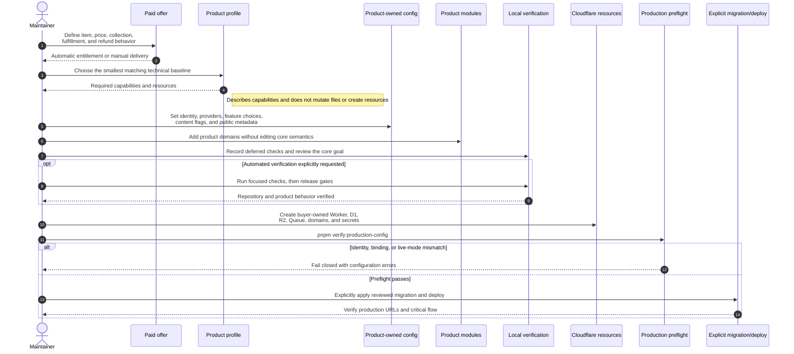

Production migration and deployment are separate, explicit operator actions.
No profile, build, test, or coding-agent task should perform them implicitly.
Charging money does not force every product through the full Billing stack:
manual services may use a product-owned order and provider payment link, while
automatic entitlement always uses verified webhook-backed state.
