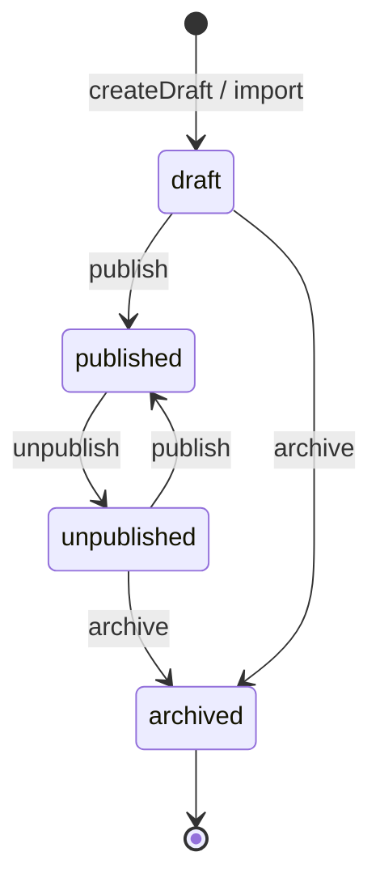

# 08 — Admin, Import & Publishing Plan（管理、导入与发布）

状态：Deferred candidate，非 v5 Foundation 实施计划。

首个 Pilot 不以本文件的 Admin / Import 能力作为上线条件：优先复用既有产品脚本和人工发布流程；只有两个 Adapter 已证明同构运营需求、且共享 Schema ADR 获批时，才可将本文件的候选流程实现为命令与 UI。
传输：oRPC `adminProcedure`（服务端 allowlist 校验，遵循上游 Admin 边界），注册于 `modules/index.ts`。所有变更写 `admin_audit_log`（复用平台 audit 模块）。

---

## 1. 业务命令，不做万能 CRUD

不提供 `updateAnyDiscoveryTable` 式通用写接口。命令清单：

| 命令 | 语义与守护的不变量 |
| --- | --- |
| `discovery.createDraft` | 创建 Item + 扩展行（同事务）；slug 生成与 `UNIQUE(resource_type, slug)` 冲突检测 |
| `discovery.updateDraft` | 乐观并发：`WHERE id=? AND revision=?`，失配返回 `CONFLICT`；同事务重建 `search_text`、同步扩展行 |
| `discovery.publish` | draft/unpublished → published；校验必填字段、taxonomy key 合法性；写 `published_at`；触发缓存失效 |
| `discovery.unpublish` | published → unpublished；写 `unpublished_at`；触发失效 |
| `discovery.archive` | 终态；要求已存在 alias 或确认无入链 |
| `discovery.changeSlug` | 更新 slug + 同事务写 `alias_redirect`（07 §4 规则） |
| `discovery.mergeItems` | 从属 Item 归并：迁移 junction/source 边、建 alias、archive 被并方 |
| `discovery.createRedirect` | 手工 alias，含链式解析与环检测 |
| `discovery.previewImport` | 见 §3 |
| `discovery.commitImport` | 见 §3 |
| `discovery.restoreRevision` | 后置项：依赖修订快照表（Capability），MVP 仅保留 audit 记录 |

词表管理（category/tag/taxonomy term/source）提供受约束的 upsert 命令：校验命名空间唯一约束、正在使用的 term 禁止硬删（只允许 `is_active=false`）。

## 2. 发布生命周期

- 公共 API 只读 published；draft/unpublished 内容对匿名 404。
- 所有状态迁移都是显式命令，不存在"写了 published_at 即可见"的隐式规则（PD 的 `defined(publishDate)` 教训）。
- `revision` 每次写 +1；Admin UI 表单携带读取时的 revision，冲突时提示重载。

## 3. Import（CSV/JSON）最小闭环

流程沿用 PDT 验证过的 collect → 归一化 → 应用三段式，落地为两个命令 + CLI：

1. **采集/上传**：CLI 脚本或 Admin 上传 CSV/JSON。原始记录写入 `discovery_import_document`（含 `source_id`、`external_id`、`import_batch_id`、`raw_json`）。
2. **`previewImport(batchId)`**：干跑归一化与校验，返回差异报告——将创建/更新/跳过的 Item 数、slug 冲突、未知 taxonomy key/term、字段校验错误。**不写内容表。**
3. **`commitImport(batchId)`**：幂等应用。匹配键优先 `(source_id, external_id)`，其次 `(resource_type, slug)`；存在则按字段合并策略更新（导入不得覆盖 Admin 手工字段——列级 provenance 记于 12 号文档开放决策，MVP 用"手工编辑过的 Item 默认跳过导入更新，除非 force"）。默认落 draft，可选 `autoPublish`（对信任来源）。重复 commit 同 batch 无副作用（幂等键 = batch + 匹配键）。

约束：单 batch 上限（默认 2000 条）；D1 写入分块事务；CLI 路径（`discovery:import` 系列脚本）与 Admin 路径共用同一归一化/校验模块。大批量或定时导入后置为 Jobs handler（`directory` Profile），MVP 不依赖 Queue。

## 4. Publish/Unpublish 与缓存

publish/unpublish/commitImport 完成后调用模块内失效钩子（07 §8）；无 purge 能力的环境静默跳过。

## 5. R2 媒体（可选能力，不阻塞 MVP）

- Core 仅存 `image_url`；导入时允许直接引用 https 外链（PDT 现状）。
- 启用 R2 的 Profile：媒体 ingest 命令下载/上传至 R2，经 `modules/assets` 建立 asset 记录与可见性（遵循"每个产品文件必须有 asset 记录"的上游规则），`image_url` 替换为资产服务 URL。**不暴露原始存储 key 作为授权决策。**
- 不做图片处理管线（缩放/裁剪走 CDN 变换或后置）。

## 6. Source Provenance

- 每个导入 Item 至少一条 `item_source` 边（is_primary），记录 `external_id`、`source_url`、`first_seen_at/last_seen_at`、`raw_snapshot_ref`。
- Admin 手工创建的 Item 可无 source（provenance = manual，体现在 audit log）。
- 详情页展示来源署名与外链（nofollow 由 source/link 配置决定）；`trust_score`/`license_note` 供运营审核参考，不参与公共排序。

## 7. Admin UI（最小范围）

`_authed` 区新增 Discovery 管理页：Item 列表（含状态筛选）、Item 编辑表单（Core 字段 + Adapter 注入的扩展字段区）、词表管理页、Import 上传/预览/提交页。复用上游 admin 组件与 `adminProcedure` 会话；不做批量表格编辑器。
