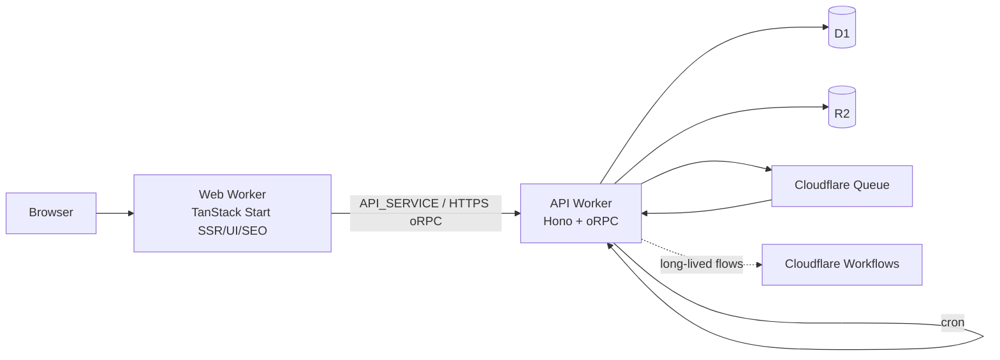

# 00 — Current state

> Phase 0 audit only. Evidence was collected from `main` at `aea4fae` on
> 2026-08-01. This document does not authorize implementation work.

## Scope and non-goals

EasyStarter is a reusable SaaS template, not a host for AIBranding, Novel,
URLS.ai, game, or any other product code. This audit covers the reusable
server, web, database, deployment, and test foundations only. It does not
evaluate production Cloudflare account permissions, real secrets, deployed
data, or GitHub branch-protection settings.

## Current topology

`apps/web/wrangler.jsonc` binds only `API_SERVICE`; it has no D1, R2, or Queue
binding. `apps/server/wrangler.jsonc` owns `DB`, `STORAGE`, and `JOB_QUEUE`.
This satisfies the intended one-way business-data ownership boundary.

## Existing reusable foundations

| Area | Current state | Main evidence |
| --- | --- | --- |
| Domain placement | Server and web module conventions documented | `apps/server/src/modules/README.md`, `apps/web/src/modules/README.md` |
| Data governance | Drizzle schemas and ordered structural migrations; separate lifecycle folders | `apps/server/src/db/` |
| Auth/admin | Better Auth sessions, server-side `ADMIN_EMAILS`, standard guards | `apps/server/src/auth/guards/` |
| Billing/credits | Webhook-backed entitlement, idempotent payment events, credit ledger | `apps/server/src/payments/`, `apps/server/src/credits/` |
| Capabilities | Server-side membership-tier capability resolver, deny by default | `modules/capabilities/` |
| Jobs | D1 job/outbox/event records, Queue consumer, retry, DLQ persistence, registry | `modules/jobs/`, `db/schema/jobs.ts` |
| Assets | D1 metadata model plus authorized R2 service | `modules/assets/`, `db/schema/assets.ts` |
| Audit | Append-only admin audit records with recursive secret redaction | `modules/audit/`, `db/schema/audit.ts` |
| Deployment safety | Production resource identity and secret preflight | `scripts/check-production-safety.ts` |
| Quality gates | lint, format, types, Expo doctor, tests, migration check, build; OSV scanning | `.github/workflows/` |

## Material findings

1. The target architecture is present and should be protected, not replaced.
2. Jobs, assets, capabilities, and audit are reusable foundations, but the
   template intentionally has no product handler, upload endpoint, or product
   capability enabled by default. Future products must adopt these foundations
   instead of creating parallel ones.
3. Several template defaults still contain adopter-specific sample identities
   (domains, app metadata, payment price IDs, and queue names). They are not
   secrets, but they are deployment-risky until a buyer replaces them.
4. The public avatar route serves a constrained raw storage-key prefix. Product
   files are expected to use asset IDs and the Asset Service; that separation
   should be made harder to bypass in a later isolated PR.
5. Current CI proves source and isolated-D1 behavior. It cannot prove live
   Cloudflare resource identity, queue creation, production secret values, or
   GitHub repository policy; the production preflight covers the first two
   only when an operator supplies the real local configuration files.

## Risk order

| Priority | Risk | Why it matters |
| --- | --- | --- |
| P0 | Adopter-owned deployment/payment identifiers can be left as template examples | Could point a new deployment at the wrong Worker, D1, R2, queue, domain, or price catalog |
| P0 | Queue operations lack an explicit production observability/incident contract | AI work can fail or accumulate without a defined alert, owner, or recovery SLO |
| P1 | Raw-key avatar serving and asset-ID serving are two access patterns | Future product code could accidentally expose a private object by copying the legacy route |
| P1 | Capability and audit foundations are opt-in conventions | A new domain can omit a required guard or audit write unless review/automation catches it |
| P1 | Data-migration folders have policy but no reusable runbook/checkpoint harness | Large product migrations can still become one-off scripts |
| P2 | No browser E2E or live-resource smoke gate | Current server-focused tests are intentionally strong, but do not cover every deployed integration |

The ordered, independently reviewable response is in `10-roadmap.md`. No
product migration or application feature work begins from this audit branch.
